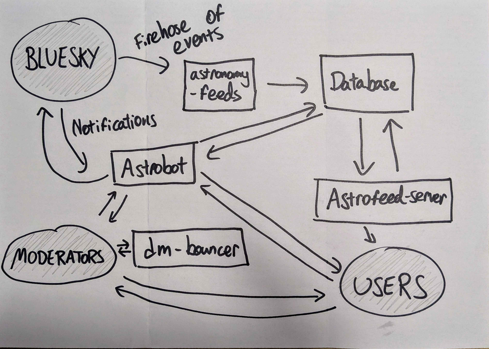

# Developer Onboarding Guide for Astronomy on Bluesky


**Welcome to the Astronomy on Bluesky development team! 🎉**

This guide is your starting point for getting up to speed with the project. It provides all the
resources, tools, and information you need to hit the ground running.


## About the Project

**System Architecture:**




## Getting Started

Follow these steps to get started:

1. **Request Access**: Ensure you have access to the required resources.
   - [ ] Bluesky account
   - [ ] Added to github Astronomy on Bluesky org
   - [ ] Added to Bluesky Devs Discord
2. **Set Up Your Environment**: Follow the [Development Environment Setup](#development-environment-setup) instructions to configure your local machine.
3. **Explore the Codebase**: Start with the [Repository Structure](#repository-structure) section for an overview of the code organization.
4. **Start Your First Task**: [Pick a First Task](https://github.com/orgs/bluesky-astronomy/projects/1) to familiarize yourself with the project and workflow.


## Development Environment Setup

**1. Install the [uv python package manager](https://docs.astral.sh/uv/):**
```bash
curl -LsSf https://astral.sh/uv/install.sh | sh
```


## Repository Structure

The **Astronomy on Bluesky** project consists of the following repositories:

| **Repository**          | **Description**                                                                                                                                                                                                      |
| ----------------------- | -------------------------------------------------------------------------------------------------------------------------------------------------------------------------------------------------------------------- |
| `astro-ph-bots`         | A collection of bots that post new papers added to astro-ph to Bluesky.                                                                                                                                              |
| `astrobot`              | A bot that handles actions on the Astronomy feeds, like signups. It will also eventually include moderation and DM tools.                                                                                            |
| `astrofeed-lib`         | Common functions for working with the Astronomy feeds, including the database and feed spec.                                                                                                                         |
| `astrofeed-news-bot`    | A bot for posting news and updates about the Astronomy feeds.                                                                                                                                                        |
| `astrofeed-server`      | Flask web app for hosting the astronomy feeds.                                                                                                                                                                       |
| `astronomy-feeds`       | Python module for crawling the [Bluesky](https://bsky.app) firehose of posts and finding all that match criteria specified by the Astronomy feeds. |
| `BlueSky-Mastadon-CLI`  | Basic command-line-interface (CLI) scripts to post to BlueSky and Mastodon simultaneously.                                                                                                                           |
| `branding`              | Branding resources and logos for the Astronomy feeds.                                                                                                                                                                |
| `development-guide`     | This guide!                                                                                                                                                                                                          |
| `dm-bouncer`            | A direct message 'bouncing' service for limited group DMs. Intended for communication for moderators on the Astronomy feed.                                                                                          |
| `Galaxy-Zoo-Poster-Bot` | A bot to post an image of a galaxy from the Galaxy Zoo archives every hour on BlueSky.                                                                                                                               |
| `rules`                 | Rules which anyone posting to the Astronomy feeds must follow.                                                                                                                                                       |
| `scripts`               | Scripts and notebooks to do various little jobs, like database maintenance or making plots.                                                                                                                          |
| `website`               | The astronomy.blue website.                                                                                                                                                                                          |


## Workflows and Standards

- **Code Style**:
  - For now, recommend following community-supported standards and best practices for each language. For example:
    - Python: [PEP 8 -- Style Guide for Python Code](https://peps.python.org/pep-0008/)
    - Typescript: [Airbnb style guide](https://github.com/airbnb/javascript)
  - Formal guidance for code style coming soon!
- **Branching Strategy**:
  - Use the `feature-`, `bugfix-`, and `hotfix-` prefixes for branches.
  - Main branches: `main`, `develop`.
- **Code Reviews**:
  - All code must go through a pull request (PR) process.
  - Assign at least one reviewer.
- **Testing**:
  - Unit tests are required (where possible) for all new features.
  - Run tests locally before submitting a PR.
- **CI/CD Pipeline**:
  - Coming soon!


## Resources and Support

### Astronomy on Bluesky
- [GitHub org that all code lives in](https://discord.com/channels/1309051071406276658/1309497906000035911/1309499545104814170)
- [The current to-do list](https://discord.com/channels/1309051071406276658/1309497906000035911/1309499545104814170)
- [Our stub website](https://discord.com/channels/1309051071406276658/1309497906000035911/1309499545104814170) that needs an overhaul...
### Useful documentation
#### AT Protocol
- [Docs for the Python SDK](https://discord.com/channels/1309051071406276658/1309497906000035911/1309500044755472415)
- [Official protocol docs](https://discord.com/channels/1309051071406276658/1309497906000035911/1309500044755472415)
- [Bluesky's source code](https://discord.com/channels/1309051071406276658/1309497906000035911/1309500044755472415)
#### Other libraries
- [peewee](https://discord.com/channels/1309051071406276658/1309497906000035911/1309500044755472415), our database ORM
#### Useful 3rd party tools
- [edavis.dev's charts of Bluesky activity](https://discord.com/channels/1309051071406276658/1309497906000035911/1309501009680138250)
- [Jaz's stats page](https://discord.com/channels/1309051071406276658/1309497906000035911/1309501009680138250)
- [Bluesky handle debug tool](https://discord.com/channels/1309051071406276658/1309497906000035911/1309501009680138250) (can also look up DIDs)
- [Clearsky search tool](https://discord.com/channels/1309051071406276658/1309497906000035911/1309501009680138250)
- [Searchable list of all firehose commits](https://discord.com/channels/1309051071406276658/1309497906000035911/1309501009680138250) (currently down as of 22nd Nov.)
